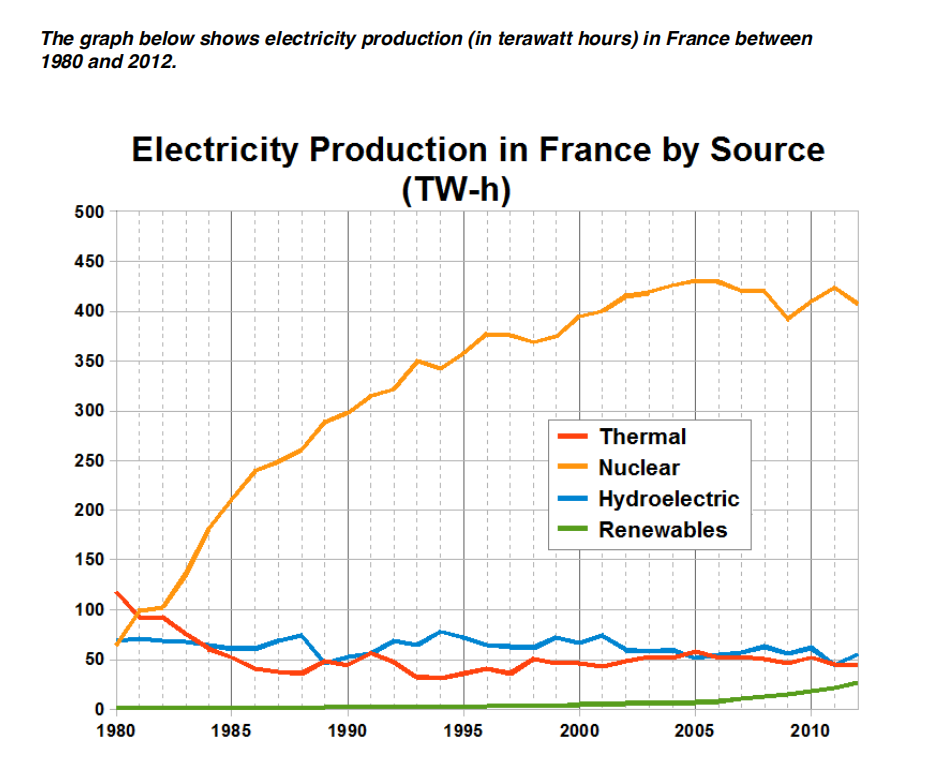

# Task1 Practices

## Line Graph

The line graph compares four types of electric power source in France from 1980 to 2012.

The graph shows that the Nuclear power was the most importpart part of electricity generation, while Renewables power produce lowest in every year.

In 1980, the Thermal power genrated is the main resource of electricity production with 125 terawatt per hour,  the Nuclear power and Hydroelectric power both provided nearly 70 terawatt per hour, while the Renewables power provided almost 0. Just one year later, the Nuclear power became the primary resource of electricity.

Duiring these 32 years, the Nuclear power rose rapidly, with heighest to almost 425 terawatt hours per hour. Thermal power dropped from 125 to 50 terawatt per hour and the Hydroelectric power reamain stable on 50 - 60 terawatt per hour. As a contrast, the Renewables power only had a small rise to 25 hour by 2012.

> The line graph compares the amount of electricity produced in France using four different sources  
>
> of power over a period of 32 years. 
>
> It is clear that nuclear power was by far the most important means of electricity generation over the  
>
> period shown. Renewables provided the lowest amount of electricity in each year. 
>
> In 1980, thermal power stations were the main source of electricity in France, generating around  
>
> 120 terawatt hours of power. Nuclear and hydroelectric power stations produced just under 75  
>
> terawatt hours of electricity each, and renewables provided a negligible amount. Just one year  
>
> later, nuclear power overtook thermal power as the primary source of electricity. 
>
> Between 1980 and 2005, electricity production from nuclear power rose dramatically to a peak of  
>
> 430 terawatt hours. By contrast, the figure for thermal power fell to only 50 terawatt hours in 1985,  
>
> and remained at this level for the rest of the period. Hydroelectric power generation remained  
>
> relatively stable, at between 50 and 80 terawatt hours, for the whole 32-year period, but renewable  
>
> electricity production saw only a small rise to approximately 25 terawatt hours by 2012. 
>
> (187 words, band 9)

> 文章的错误：
>
> 1. "importpart" 改为 "important"
> 2. "Renewables power produce lowest" 改为 "renewable power consistently produced the least amount of electricity"
> 3. "Thermal power genrated is the main resource" 改为 "thermal power generation was the main source"
> 4. "almost 0" 改为 "almost none"
> 5. "primary resource" 改为 "primary source"
> 6. "heighest" 改为 "reached a peak of"
> 7. "50 - 60" 改为 "around 50-60"
> 8. "25 hour" 改为 "25 terawatt hours"