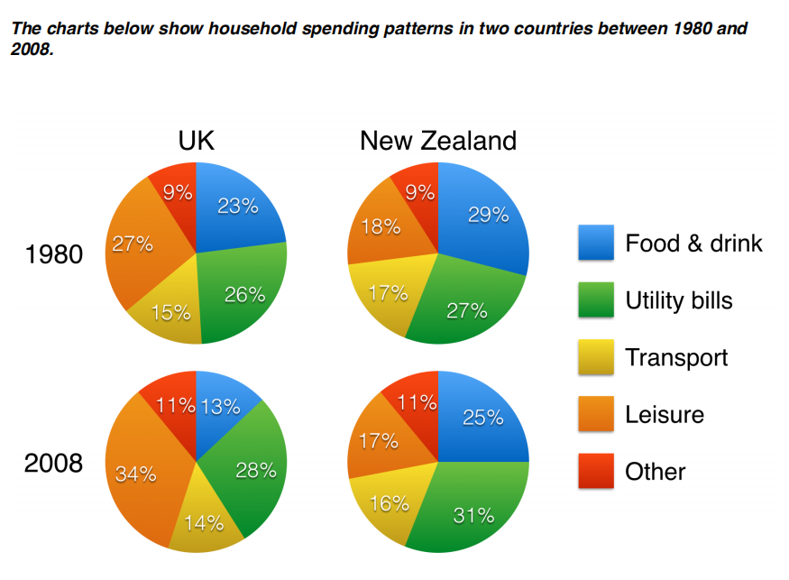

# Task1 Practices

## Line Graph

### Pratice

The line graph compares four types of electric power source in France from 1980 to 2012.

The graph shows that the Nuclear power was the most importpart part of electricity generation, while Renewables power produce lowest in every year.

In 1980, the Thermal power genrated is the main resource of electricity production with 125 terawatt per hour,  the Nuclear power and Hydroelectric power both provided nearly 70 terawatt per hour, while the Renewables power provided almost 0. Just one year later, the Nuclear power became the primary resource of electricity.

Duiring these 32 years, the Nuclear power rose rapidly, with heighest to almost 425 terawatt hours per hour. Thermal power dropped from 125 to 50 terawatt per hour and the Hydroelectric power reamain stable on 50 - 60 terawatt per hour. As a contrast, the Renewables power only had a small rise to 25 hour by 2012.

### Correction

> 文章的错误：
>
> 1. "importpart" 改为 "important"
> 2. "Renewables power produce lowest" 改为 "renewable power consistently produced the least amount of electricity"
> 3. "Thermal power genrated is the main resource" 改为 "thermal power generation was the main source"
> 4. "almost 0" 改为 "almost none"
> 5. "primary resource" 改为 "primary source"
> 6. "heighest" 改为 "reached a peak of"
> 7. "50 - 60" 改为 "around 50-60"
> 8. "25 hour" 改为 "25 terawatt hours"

### Modal essay

> The line graph compares <u>the amount of electricity produced</u> in France using four different <u>sources</u>  
>
> <u>of</u> power <u>over a period of</u> 32 years. 
>
> It is clear that nuclear power was <u>by far the most important</u> <u>means of electricity generation</u> over the  
>
> period shown. Renewables <u>provided</u> the lowest amount of electricity in each year. 
>
> In 1980, thermal power stations were the main source of electricity in France, <u>generating</u> around  
>
> 120 terawatt hours of power. Nuclear and hydroelectric power stations produced just under 75  
>
> terawatt hours of electricity each, and renewables provided <u>a negligible amount</u>. Just one year  
>
> later, <u>nuclear power overtook thermal power</u> <u>as the primary source of electricity</u>. 
>
> Between 1980 and 2005, electricity production from nuclear power <u>rose dramatically to a peak of</u>  
>
> 430 terawatt hours. <u>By contrast</u>, <u>the figure for</u> thermal power fell to only 50 terawatt hours in 1985,  
>
> and <u>remained at this level</u> for the rest of the period. Hydroelectric power generation <u>remained</u>  
>
> <u>relatively stable</u>, at between 50 and 80 terawatt hours, for the whole 32-year period, but renewable  
>
> electricity production <u>saw only a small rise</u> to approximately 25 terawatt hours by 2012. 
>
> (187 words, band 9)

## Bar chart

### Practice

The bar chart compares the amount of phone sold by the five most popular brand in 2009, 2011 and 2013.

It is clear that Nokia sold the most in 2009 and 2011, while in 2013 Samsung became the seller. LG sold less and less by each year and ZTE remained its sellings nealy 50 millions.

In 2009 ,Nokia sold cloase to 450 millions phone, which was almost the double of Samsungs sales. In 2011, Samsung phone sales rose from 240 to 330 millions which is the second biggest phone brand. In 2013, Samsung sales came to 450 millions  which made it became the primary phone brand. As a contrast, Nokia only sold 220 millions their phone, which was just a half of their sales by 2009.

From 2009 to 2019, Apple sales also rose rapidly each year, from 40 millions to 140 millions. LG sold 110 millions in 2009 and decreased nearly 30 millions each year. And ZTE sold 55 millions in 2019 and it ramained it stably till 2013.

### Correction

> 请帮我润色这篇文章，找出所有错误并修改：
> 1. "amount of phone sold" 改为 "number of phones sold"
> 2. "Nokia sold the most" 改为 "Nokia sold the most phones"
> 3. "LG sold less and less by each year" 改为 "LG's sales decreased each year"
> 4. "ZTE remained its sellings nealy 50 millions" 改为 "ZTE's sales remained steady at around 50 million"
> 5. "cloase" 改为 "close"
> 6. "Samsungs" 改为 "Samsung's"
> 7. "which is the second biggest phone brand" 改为 "making it the second biggest phone brand"
> 8. "made it became" 改为 "making it"
> 9. "just a half of their sales" 改为 "just half of their sales"
> 10. "From 2009 to 2019" 改为 "From 2009 to 2013"
> 11. "Apple sales also rose rapidly each year" 改为 "Apple's sales also rose rapidly each year"
> 12. "it ramained it stably" 改为 "which remained stable"

### Modal essay

> The bar chart compares the number of mobile phones <u>sold worldwide</u> by the five <u>most popular</u>  
>
> <u>manufacturers</u> in the years 2009, 2011 and 2013. 
>
> It is clear that Nokia sold the most mobile phones between 2009 and 2011, but Samsung became  
>
> the <u>best selling brand</u> in 2013. Samsung and Apple saw the biggest rises in sales over the 5-year  
>
> period. 
>
> In 2009, Nokia sold close to 450 million mobile phones, which was <u>almost double the number of</u>  
>
> handsets sold by the <u>second most successful manufacturer</u>, Samsung. Over the following four  
>
> years, however, Nokia’s <u>sales figures</u> fell by <u>approximately</u> 200 million units, <u>whereas</u> Samsung  
>
> saw sales <u>rise by a similar amount</u>. By 2013, Samsung had become the <u>market leader</u> with sales  
>
> <u>reaching</u> 450 million units. 
>
> The other three top selling mobile phone brands between 2009 and 2013 were LG, ZTE and Apple.  
>
> In 2009, these companies sold around 125 million, 50 million and 25 million mobile <u>handsets</u>  
>
> <u>respectively</u>, but Apple <u>overtook the other two vendors</u> in 2011. In 2013, <u>purchases</u> of Apple  
>
> handsets reached 150 million units, while LG saw declining sales and the figures for ZTE rose only  
>
> slightly. 
>
> (190 words, band 9)

## Pie Chart

### Practice

The pie chart compares five categories of hosehold spenmding in UK and New Zealand from 1980 to 2008.

It is clear that the proportion of spending on foods decreased in both conturies espically in UK. Also, the UK residents spent more on their utility bills.

In 1980, the foods and drinks took 23% of household spending in UK and 29% in New Zealand. In 2008, these figures became 13% and 25%, both were decreased. As a contrast, The spending on utility bills were increased in both conturies, from 26 % to 28% in UK and 27% to 31% in New Zealand.

Leisure activities accounted for most in UK household spending in both years, while the counterpart in New Zealand just fallen by 1% to 17%. The transport spedning fallen by 1% in both countries during the period. The other spending are both took 9% in 1980 and 11% in 2008.

### Correction

> 以下是您提供的文章的修改意见：
>
> 1. "hosehold spenmding"应为 "household spending"。
> 2. "conturies"应为 "countries"。
> 3. "espically" 应为 "especially"。
> 4. "foods"应为 "food"，因为"food"在这里是不可数名词。
> 5. "both were decreased"应为 "both of which decreased"。
> 6. "The spending on utility bills were increased"应为 "Spending on utility bills increased"，因为"spending"是单数形式。
> 7. "conturies"应为 "countries"。
> 8. "spedning"应为 "spending"。
> 9. "fallen"应为 "fell"。
> 10. "counterpart"应为 "equivalent"，因为这里是在指代相同的类别（leisure activities）。
> 11. "just fallen by 1%"应为 "had fallen by 1%"。
> 12. "transport spedning fallen"应为 "spending on transport fell"。
> 13. "are both took"应为 "both accounted for"。

### Modal essay

> The pie charts compare five categories of household <u>expenditure</u> in the UK and New Zealand in  
>
> the years 1980 and 2008. 
>
> It is <u>noticeable</u> that the <u>proportion of spending</u> on food and drink fell in both countries over the 28- 
>
> year period, while <u>spending</u> on utility bills <u>rose</u>. Also, UK residents <u>spent a significantly larger</u>  
>
> <u>percentage of their household budgets</u> on leisure than their <u>New Zealand counterparts</u>. 
>
> In 1980, <u>29% of an average New Zealand household budget</u> went on food and drink, while <u>the</u>  
>
> <u>equivalent figure for a UK home</u> was 23%. <u>By 2008, expenditure on food and drink had fallen</u> by  
>
> 4% in New Zealand, and by a full 10% in the UK. <u>By contrast</u>, both countries <u>saw an increase</u> in  
>
> expenditure on utility bills for the average home, from 27% to 31% in New Zealand and from 26%  
>
> to 28% in the UK. 
>
> <u>Leisure activities accounted for</u> the highest proportion of UK household spending in both years, but  
>
> only the <u>third highest proportion</u> in New Zealand. In fact, in 2008, New Zealanders <u>spent only half</u>  
>
> <u>as much in relative terms</u> on <u>recreation</u> (17%) as UK residents (34%). In both countries, transport  
>
> costs and other costs took roughly 15% and 10% of household budgets respectively. 
>
> (206 words, band 9) 
>
> *Note: word count includes all numbers*

#### Tips

- Don’t describe each country separatly
- Don’t describe each year separately
- Compare countries and years <u>together</u>
- Mention all 5 categories (food & drink etc.)
- Divide the catergories into two groups for the two ‘details’ paragraphs
- The category called ‘Other’ is not important
- Don’t write ‘Leisure was 34%’
- Write “Households spend 34% of their money on leisure”

### Table

The table compares the number of torists and the money spent by tourist of top five countries for international tourism in 2012 and 2013.

It is noticable that the USA earned most money from tourist, more that 100 billion. However, it was France that attracted the most tourists to visit.

In 2012, 83 millions tourists visited France, making it became the most popular of five. The USA was the second most visited country, with 66.7 millions tourists. The Spain and the China had similar number of tourists, 57.5 millions tourists visited Spain and 0.2millions more tourisits visited China. However, Italy only got 46.4 millions tourists. One year later, all contories rose 1 to 4 millions tourists, except China, which decreased to 55.7 millions.

Spenting by tourist in USA rose form 126.2 millions in 2012  to 139.6 millions in 2013, this was almost the Acummalation of France(53.6 millions and 56.1 millions), Italy(41.2 billion and 43.9 billion) and China (50.0 billion and 51.7 billion). The Spain got second biggest rose, which is 4 billion, from 56.3 billion to 60.4 billion, while China only rose 1.7 billion.

### Correction

> 以下是您提供的文章的修改意见：
>
> 1. "torists" 应为 "tourists"。
> 2. "more that" 应为 "more than"。
> 3. "making it became the most popular of five" 应为 "making it the most popular of the five".
> 4. "the China" 应为 "China"。
> 5. "Italy only got 46.4 millions tourists" 应为 "Italy received only 46.4 million tourists".
> 6. "all contories rose" 应为 "all countries saw an increase".
> 7. "except China, which decreased to 55.7 millions" 应为 "except for China, which saw a decrease to 55.7 million".
> 8. "Spenting" 应为 "Spending"。
> 9. "form" 应为 "from"。
> 10. "139.6 millions" 应为 "139.6 billion"。
> 11. "this was almost the Acummalation" 应为 "which was almost the combined total".
> 12. "and 51.7 billion" 应为 "and 51.7 billion respectively".
> 13. "The Spain" 应为 "Spain"。
> 14. "which is 4 billion" 应为 "which was a rise of 4 billion".
> 15. "only rose 1.7 billion" 应为 "only saw a rise of 1.7 billion".

### Modal essay

> The table compares the <u>five highest ranking countries</u> in terms of the numbers of visits and the  
>
> money spent by tourists over a period of two years. 
>
> It is clear that France was <u>the world’s most popular tourist destination</u> in the years 2012 and 2013.  
>
> However, the USA <u>earned by far the most</u> <u>revenue from tourism</u> over the same period. 
>
> In 2012, 83 million tourists visited France, and the USA was <u>the second most visited country</u>, with  
>
> 66.7 million tourists. Spain and China each <u>received just under 58 million visitors</u>, while Italy was  
>
> <u>ranked fifth</u> with 46.4 million tourists. <u>2013 saw a rise of</u> between 1 and 4 million tourist visits to  
>
> each country, with the exception of China, which received 2 million <u>fewer visitors than in the</u>  
>
> <u>previous year</u>. 
>
> Spending by tourists visiting the USA increased from $126.2 billion in 2012 to $139.6 billion in  
>
> 2013, and <u>these figures were well over twice as high as</u> those for any other country. Spain received  
>
> the second highest <u>amounts of tourist revenue</u>, rising from $56.3 billion to $60.4 billion, followed by  
>
> France, China and Italy. Interestingly, <u>despite falling numbers</u> of tourists, Chinese revenue from  
>
> tourism <u>rose by</u> $1.7 billion in 2013. 
>
> (200 words, band 9) 
>
> *Note: word count includes all numbers*0

### 2 Different charts

The bar chart compares the numbers of male and female joining 4 types of classes in 2009. The pie chart shows the age of these attenders.

It is noticable that most of women prefered attend the Language class while men would like to joined in the Painting course. Meanwhile, almost half of students were 50 or over.

The bar chart shows that drama, panting and language attracted more women that men to join the class. In spint of Sculpture had male student than female, it's stundents number was miniumn. As a contrast, language course were the most popular one, attracted 40 female students and 20 male students. The another class that the number of male studens was half of female students was drama, with 10 male students and 20 female students.

From the pie chart we can know that 68% of students' age were over 40, with 42% over 50 and 26% between 40 and 49. Meanwhile, both age between 20 and 29 and aged under 29 were 16%, with 5% under 20 and 11% aged from 20 to 29.

### Correction

> 1. "noticable" 应改为 "noticeable"，拼写错误。
> 2. "prefered" 应改为 "preferred"，拼写错误。
> 3. "joined in" 应改为 "joined"，用词不恰当。
> 4. "stundents" 应改为 "students"，拼写错误。
> 5. "miniumn" 应改为 "minimum"，拼写错误。
> 6. "male studens" 应改为 "male students"，拼写错误。
> 7. "From the pie chart we can know that" 应改为 "Looking at the pie chart, we can see that"，用词不恰当。
> 8. "aged under 29" 应改为 "aged 30 to 39"，错误数据。

### Modal essay

> The bar chart compares the numbers of males and females <u>who took four different evening classes</u> 
>
> in 2009, and the pie chart shows the age profile of these <u>attendees</u>.
>
> It is clear that <u>significantly more women than</u> men <u>attended evening classes</u> at the education 
>
> centre. We can also see that evening courses were much more popular among older adults.
>
> <u>According to the bar chart</u>, drama, painting and language courses all <u>attracted more women than</u> 
>
> <u>men</u> to the education centre in 2009. Language classes <u>had the highest number of</u> <u>participants</u> 
>
> overall, with 40 female and 20 male students, while painting was <u>a popular choice among both</u> 
>
> <u>genders</u>, <u>attracting</u> 30 female and 25 male attendees. The only course with a higher number of 
>
> males was sculpture, but this course <u>was taken by a mere 15 people in total</u>.
>
> <u>Looking at the age profile pie chart</u>, we can see that <u>the majority of</u> people attending evening 
>
> lessons were over 40 years of age. <u>To be precise</u>, 42% of them were aged 50 or more, and 26% 
>
> were aged between 40 and 49. Younger adults <u>were in the minority</u>, with only 11% of students 
>
> aged 20 to 29, and only 5% aged under 20.
>
> (200 words, band 9)
>
> *Note: word count includes all numbers*