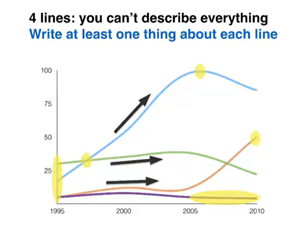
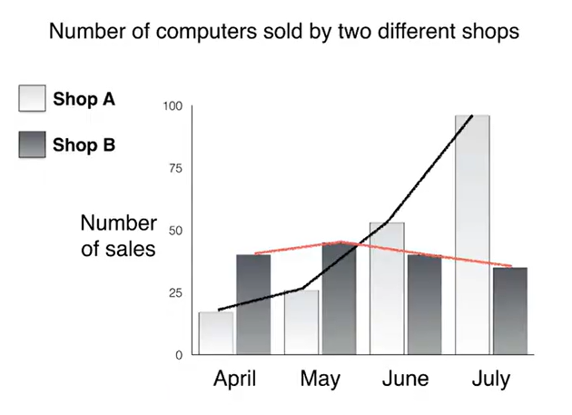
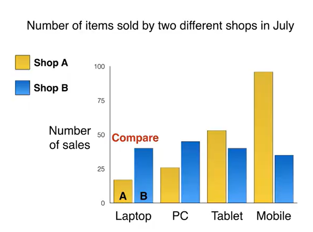
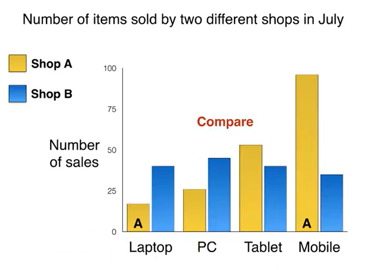
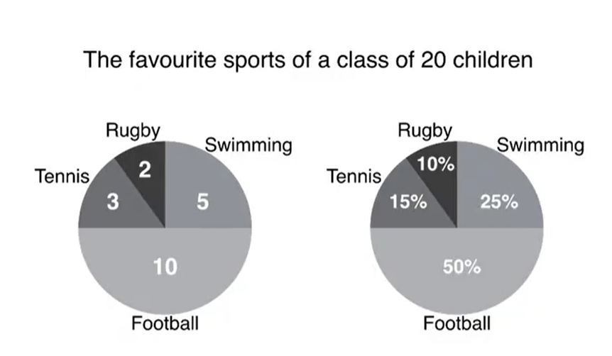
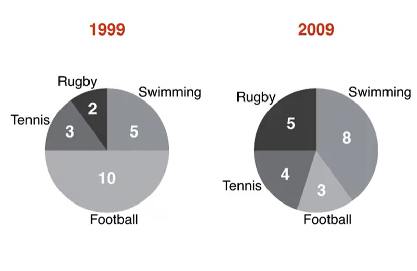
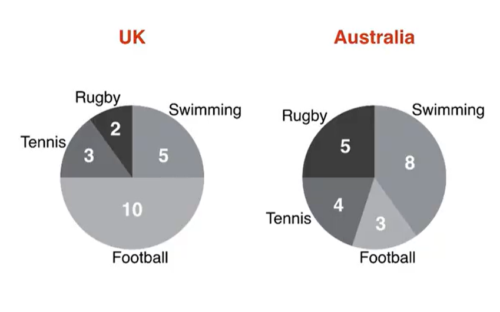

#  Writing Task 1n

## Lesson1

> ### Remember
>
> The task is to describe what you see. Write a report. Don’t give opinions.
>
> No conclision. Instead write a summary (the overview)

### Question types

1. Line graph 线条图
2. Bar graph 条形图
3. Pie chart 饼图
4. Table 图表
5. Diagram - comparing 一个比较事物的图表
6. Diagram - process 一个展示过程的图表

对于前四个种类，他们的共同点是都会带有数字，而需要做的就是描述Describe这些数字，比较Compare这些数字，然后讲述他们的变化以及趋势Changes/Trends。

对于第五种与前四种比较相似，也需要比较，但只是没有数字，唯一有区别的就是第六种流程图

### Essay structure

1. Introduction
2. Overview
3. Details
4. Details

> Or put the overview at the end

#### 1. Introduction 

​	One sentence: Paraphrase the question 用一句话解释总结这个表，可以换个说法重新说一次图表的title。

> The graph below shows **electricity production**(in terawatt hours) *in France* `between 1980 and 2012`
>
>  -->
>
> The line graph compares **the amount of electricty** produced *in France* using four different sources of powe`r over a period of 32 years`

#### 2. Overview

​	2 sentences: Explain or describe The main, general things

#### 3+4. Details

​	Includes numbers and you do your comparisons or trends

> Why 2 paragraphs?
>
> This makes you organise or ‘group’ the information better

## Lesson 2 - Line Graphs

Line graphs show numbers changing over a period of time

> You will not see a graph with only one line
>
> You will almost definitely see 2,3,4,or 5 lines, usually 3 or 4
>
> Your job is to compare the lines, not describe them separately

**First, make  a very general comparison (summary / overview paragraph)**

**Second, compare the lines at specific points(details paragraphs)**

可以在开头比较，或者说蓝线在超过绿线后一直保持最高，或者蓝线在什么时候达到最高点，紫色线一直以来很平稳，有非常多的事情可以比较和形容，但是没有办法每个都写，所以要做出**选择**。You can’t describe everything, **Write at least one thing about each line.**

## Lesson 3 -  Bar Chart

Bar charts <u>can</u> show numbers changing over a period of time

可以看到，对于Shop A它是逐步升高的，而对于Shop B则是相对平稳的，可以画出两条折线图来表明他们的趋势

> This type of bar chart is the same as a line graph

**However, Bar charts don’t always show time... they often only compare numbers**

在这张图里，就无法像上一个一样连出一条线了，因为X轴不再是时间，而是不同的类别，所以在这里要做的就是比较柱子，比如，在AB两个商店里，B店的Laptop售卖的更好。

同样的，也可以在同一商店内进行比较，例如商店A内，手机卖的比Laptop好。

> Your job is to comapre the bars.

**First,** make a very general comparison (summary / overview paragraph)

例如，上图我们可以得出，A店的Mobile是最高的，B店内每一样售卖的数量都差不多，不需要说出具体的数字，只需要进行简单浅显的比较即可。

**Second,** compare specific numbers (‘details’ paragraphs)

现在您需要给出具体数字来比较，例如每家店卖的最多的数量，卖的最高的价格等等。

## Lesson 4 - Pie charts

Pie charts <u>can</u> show numbers, but they <u>always</u> show percentages

对于这个饼图，我们可以写出以下句子

1. Football is the favourite sport of 10 children in the class.
2. 50% of the children in the class prefer football to any other sport.
3. Half of the class said that football was their favourite sport.

> 值得注意的是，上面的句子来源于右边的百分比饼图，即使没有百分比，依靠左边同样可以说 Half of the class said that football was their favourite sport. 如果这些数字都没有，那也可以靠看估计，写出Around 50% of the children in the class prefer football to any other sport.

Remember: the full pie is always 100%

**Pie charts can show changes over time (e.g. years)**

The categories are the same, 时间的不同，所以可以说数字的增加或减少

**But pie charts don’t always how changes over time**

这里展示了两个国家，或者任意两个地区或其他的东西。这里的数字就不可以说增加和减少了，只可以单纯的比较数字的大小

**Your job is to compare the percentages (and numbers)**

After introduction, you’re going do 2 types of comparison

**First, **make a very general comparision (in summary / overview paragraph)

**Second, ** compare specific figures (‘details’ paragraphs)